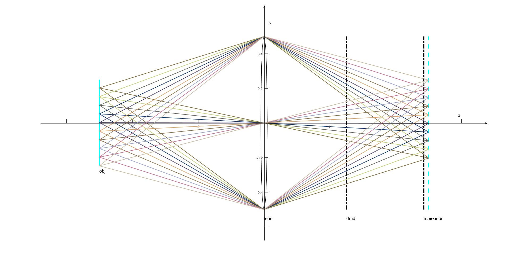
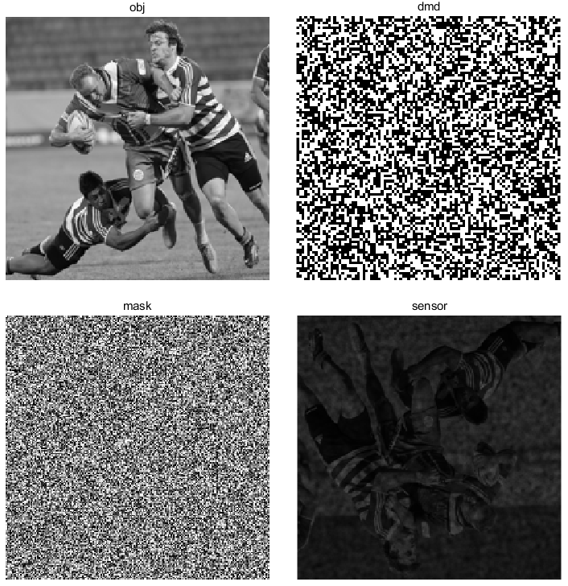

# Optical Simulation for CACTI (Coded Aperture Compressive Temporal Imaging) System

This repository provides a simulation tool for coded aperture compressive temporal imaging based on geometrical optics.

Maintained by [Zhihong Zhang](https://github.com/dawnlh/)



## CACTI: Coded Aperture Compressive Temporal Imaging

This CACTI system contains an object, a DMD (Digital Mirror Device), a lens, a static mask and a sensor. The lights emitting from object are collected by the lens and converge towards the sensor (image plane). When propagating through the image space, the light spot will be modulated by DMD and mask before they  are finally captured by the sensor. By using dynamic low-resolution DMD masks to modulate the static high-resolution mask, we can synthesize a set of virtual dynamic high-resolution masks, which can be calibrated with a whiteboard. When using the CACTI system to capture the natural objects, these high frequency virtual masks will modulate the scene of different time points. And after that, a set of modulated scenario images will be collected and summed up by the low-speed sensor during one exposure time to form a single frame. By incorporating compressive imaging reconstruction algorithm, we can figure out the coherent scene images to recover a high-speed video sequence.



## Usage 

### Environment

The code can run successfully on Windows10, Matlab 2018b. It's supposed to run normally on other platforms  (like linux) with relative new version Matlab installed, too.

### CACTI imaging

The main script is "cacti_imaging.m", change the parameter settings and the input data in the code and run it to get the images simulated by CACTI system.

```matlab
  - sys_params: system parameters, 1*1 struct, with the following fields:
      obj_pos, obj_size, obj_pix_size;
      lens_pos, lens_f, lens_radius;
      dmd_pos, dmd_size, dmd_pix_size;
      mask_pos, mask_size, mask_pix_size;
      sensor_pos, sensor_size, sensor_pix_size
      
  - ctrl_params: controlling parameters, 1*1 struct, optional, with the 
    following fields:
      show_compare_flag   % show obj, dmd, mask and image, default = 1;
      drawing_flag		  % drawing the optical system
      resampling_factor   % resampling factor for MASK_PROPAGATE
      ideal_sensor_flag   % sensor conducts ideal sampling
      TEST_MODE_FLAG_     % test mode for MASK_PROPAGATE, default = 'non-test'
      parallel_flag       % whether to use parallel calculation in CACTI      

  - obj: object pattern stack(gray image), 3D numeric matrix, [h, w, batch_num]

  - dmd: dmd pattern stack, 3D logical(double) matrix, 0|1, [h, w, batch_num]

  - mask: mask pattern, 2D logical matrix (binary mask,0|1) or 2D float
    matrix(gray mask, [0,1])

```

### Light propagation demonstration

To see the simulation pipeline, you can run "light_propagation.m" and change the parameter settings to enable the real time illustration of light propagation and light spot changing.


## Structure of directories

| directory    | description                                   |
| ------------ | --------------------------------------------- |
| arxiv        | archived codes                                |
| bak          | backup codes                                  |
| cacti        | core codes for CACTI simulation               |
| CI algorithm | compressive imaging reconstruction algorithms |
| config       | parameters config file                        |
| dataset      | dataset                                       |
| demo         | demo pictures                                 |
| result       | code result                                   |
| utils        | utility codes                                 |


## Reference

> [1] T. Bishop, S. Zanetti, and P. Favaro, “Light Field Superresolution,”  in Proc. ICCP ’09. IEEE International Conference on Computational Photography, 2009.
>
> [2] **Plug-and-play Algorithms for Large-scale Snapshot Compressive Imaging** in ***IEEE/CVF Conference on Computer Vision and Pattern Recognition (CVPR)*** 2020 (**Oral**) by [Xin Yuan](https://www.bell-labs.com/usr/x.yuan), [Yang Liu](https://liuyang12.github.io/), [Jinli Suo](https://sites.google.com/site/suojinli/), and [Qionghai Dai](http://media.au.tsinghua.edu.cn/). [[pdf\]](https://arxiv.org/pdf/2003.13654) [[github\]](https://github.com/liuyang12/PnP-SCI) [[arXiv\]](https://arxiv.org/abs/2003.13654)
>
> [3] **Deep Learning for Video Compressive Sensing** (***APL Photonics 5, 030801 (2020)***) by Mu Qiao*, Ziyi Meng*, Jiawei Ma, [Xin Yuan](https://www.bell-labs.com/usr/x.yuan) (*Equal contributions). [[pdf\]](https://aip.scitation.org/doi/pdf/10.1063/1.5140721?download=true) [[doi\]](https://aip.scitation.org/doi/10.1063/1.5140721)


## Contact

Zhihong Zhang, Tsinghua University，z_zhi_hong@163.com


  <div style="text-align: center"> Copyright (c) 2020 Zhihong Zhang </div>  
